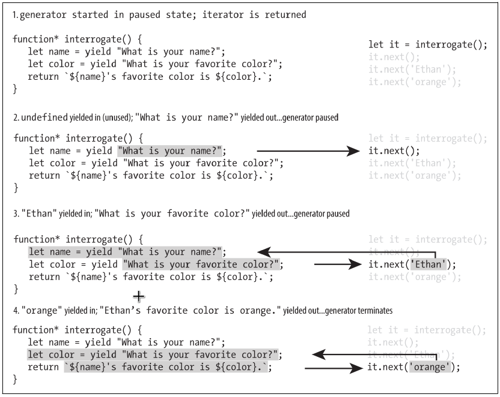

# Chapter 10. Iterator and Generator

> all scripts in this chapter needed running by node-v9.3.0 with `--harmony_array_prototype_values` flag

## Iterator

- Iterable objects can produce iterators by its `value()` method
- `next()` advance the iterator by one, and return (demo as `iterator/basics.js`)
  - `done`: `true` or `false`
  - `value`
    - For `done` as `false`, underlying object anchored by this current iterator
    - Otherwise, `undefined`
- The `for...of` loop will work with anything that provides an iterator
- Iterators help to emulate a `for...of` loop with a while loop (demo as `iterator/for-of-sim.js`)
- Iterators are distinct (demo as `iterator/distinctness.js`)

## The Iteration Protocol

- **DEFINITION**: A class is iterable if it provides a symbol method `Symbol.iterator` that returns an object with iterator behavior (i.e., it has a `next()` method that returns an object with `value` and `done` properties) (demo as `iterator-proto/proto{1,2}.js`)
- Iterators can also be used to represent object that never run out of values (e.g. the generation of Fibonacci sequence)

## Generator

- **DEFINITION**: Generators are functions that use an iterator to control their execution

(demo as [generator/basic.js](generator/basic.js))

- Two ability
  - Control the execution of a function, having it execute in discrete steps
  - communicate with the function as it executes
- Two exceptions to regular functions
  - Generators can _yield_ control back to the caller at any point
  - Calling the generator returns an iterator, and the execution of the generator is triggered by invoking `next()` on the iterator
- Signatures

  ```javascript
  function* generator-name() { ... }
  ```

- Use `yield` and `return` to switch control

### yield Expressions and Two-Way Communication

- Communication between the called generator and the callee by `yield` expression
- Value evaluated by `yield` is the argument passed into `next()` by the caller
- An example (coded as [interrogate.js](generator/interrogate.js)) is depicted as

  

> Generators cannot be created with arrow notation

### Generators and return

- Calling `return` from anywhere in the generator will result in `done` being `true`, with the `value` property being user-defined
- `for...of` loop ignores the value paired with `done=true`
